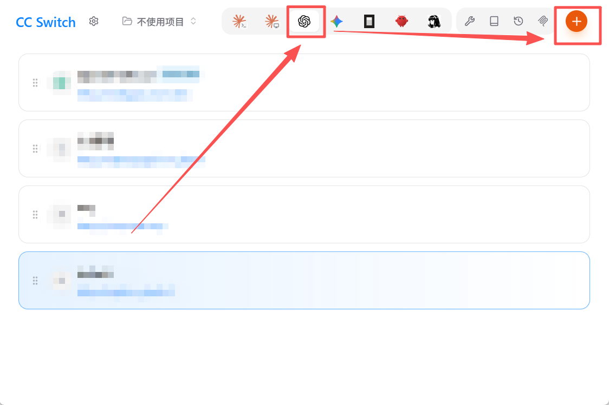
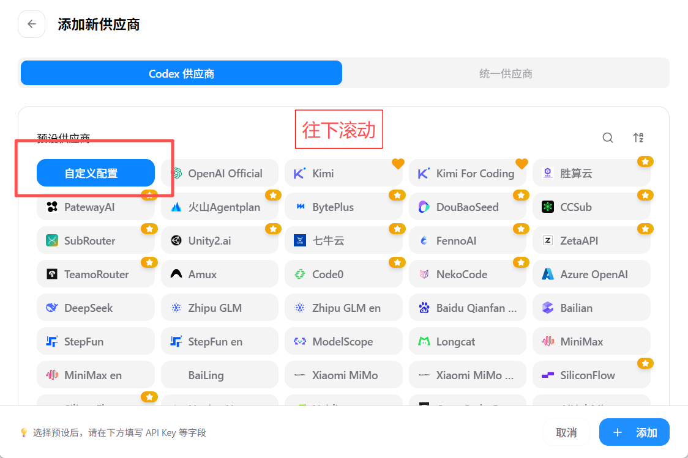
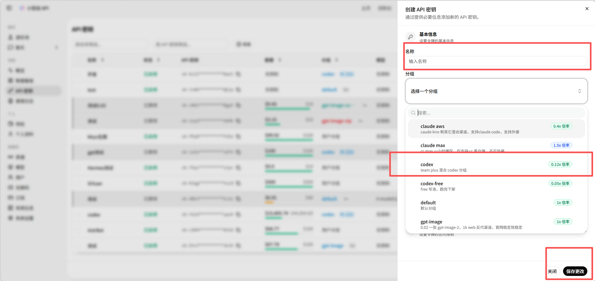
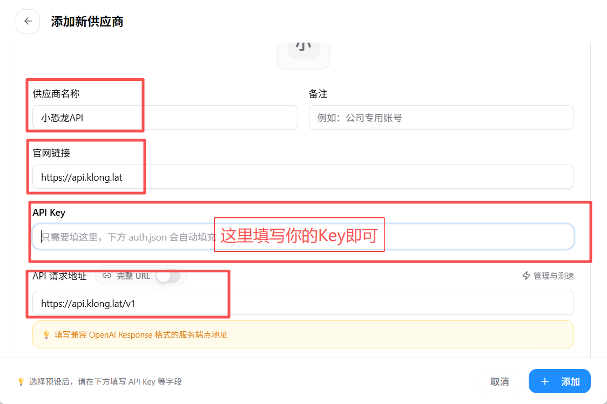
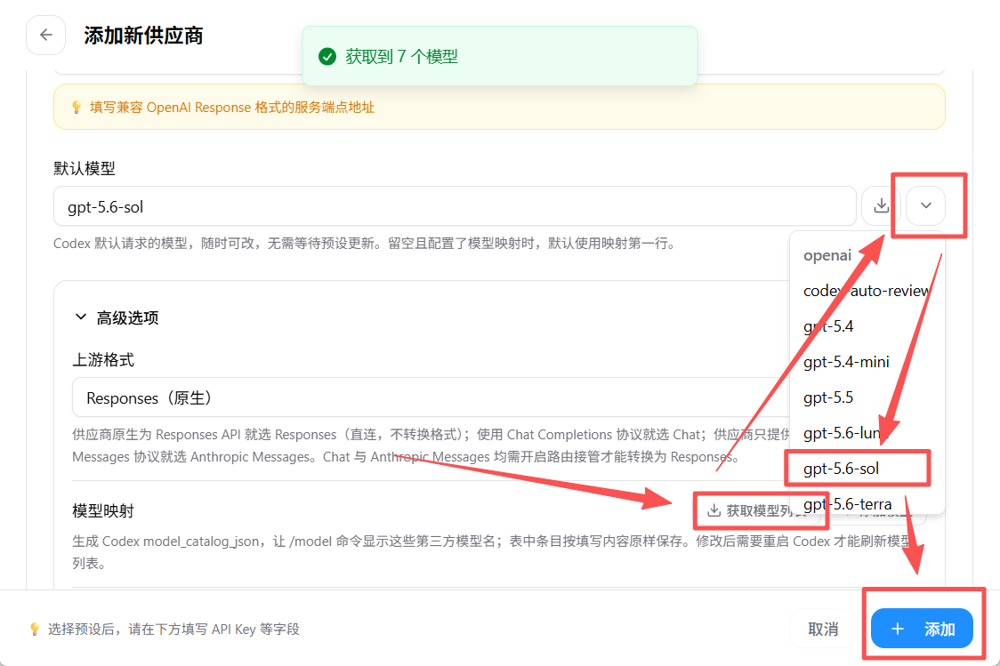
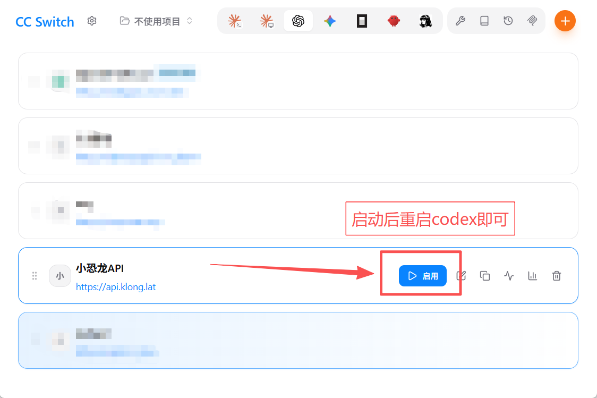

# 使用 CC Switch 配置 Codex 接入小恐龙 API

本教程适合不熟悉 Codex 配置文件的 Windows 用户。通过 CC Switch 添加小恐龙 API 供应商后，即可让 Codex 的对话与代码任务使用小恐龙 API。

> 本页配置的是 Codex 主模型。需要在 Codex 中生成图片时，还需安装 [`klong-image`](../skills/klong-image) Skill。

## 准备工作

开始前请确认：

- 已安装 Codex
- 已注册小恐龙 API 账号
- 电脑能够正常访问 GitHub 和 `https://api.klong.lat`

## 第一步：下载安装 CC Switch

打开 [CC Switch Releases](https://github.com/farion1231/cc-switch/releases)，根据自己的操作系统下载合适版本并完成安装。

Windows 用户通常选择 Windows 安装包。安装完成后启动 CC Switch。

## 第二步：添加 Codex 供应商

进入 CC Switch 后：

1. 点击顶部的 **Codex** 图标。
2. 点击右上角的 **+**。



在“添加新供应商”页面向下滚动，选择 **自定义配置**。



先不要关闭这个页面，下一步创建 API Key。

## 第三步：创建小恐龙 API Key

打开 [小恐龙 API Key 管理页面](https://api.klong.lat/keys)，点击创建新的 API Key。

建议按下面方式填写：

1. 名称填写容易识别的名称，例如 `Codex` 或 `我的电脑-Codex`。
2. 分组选择 **codex**。
3. 保存创建。



创建成功后复制 API Key。Key 通常只会完整显示一次，请妥善保存，不要发送到聊天、Issue、截图或公开仓库。

## 第四步：填写供应商配置

回到 CC Switch 的“添加新供应商”页面，填写：

| 配置项 | 填写内容 |
| --- | --- |
| 供应商名称 | `小恐龙API` |
| 官网链接 | `https://api.klong.lat` |
| API Key | 刚刚创建的 Key |
| API 请求地址 | `https://api.klong.lat/v1` |



请特别检查 API 请求地址末尾包含 `/v1`，不要重复填写成 `/v1/v1`。

## 第五步：获取并选择模型

填写完成后：

1. 点击 **获取模型列表**。
2. 在默认模型下拉列表中选择当前账号可用的 Codex 模型。
3. 上游格式保持 **Responses（原生）**。
4. 点击右下角的 **添加**。



截图中的模型名称仅作示例。模型列表可能随账号分组和服务更新发生变化，请选择页面实际返回的可用模型。

## 第六步：启用供应商

返回供应商列表，找到刚刚添加的 **小恐龙API**，点击 **启用**。



完全退出并重新打开 Codex，使新配置生效。现在可以在 Codex 中发起一个简单任务，确认模型能够正常回复。

## 安装图片生成 Skill

CC Switch 配置只负责 Codex 主模型。如果还要让 Codex 调用小恐龙图片模型，请把下面这句话发送给 Codex：

```text
请从 https://github.com/yukkcat/klong-skills/tree/main/skills/klong-image 安装这个 Skill。
```

安装后按照项目首页配置 `KLONG_API_KEY`，然后可以直接输入：

```text
使用 $klong-image，通过 gpt-image-2 生成一张白底产品图，保存到 outputs/product.png。
```

## 常见问题

### 获取不到模型

- 检查 API Key 是否复制完整。
- 检查 Key 分组是否为 `codex`。
- 检查 API 请求地址是否为 `https://api.klong.lat/v1`。
- 登录小恐龙 API 控制台检查余额和账号权限。

### 启用后 Codex 没有变化

完全退出 Codex 后重新启动。只关闭当前任务或窗口可能不会重新加载配置。

### 返回 `401` 或 `403`

Key 无效、已失效或没有相应模型权限。重新创建 Key，并确认选择了正确分组。

### 返回 `404`

检查 API 请求地址。Codex 主模型地址应填写 `https://api.klong.lat/v1`，不能只填官网地址，也不能重复添加 `/v1`。

### 如何切回其他供应商

返回 CC Switch 的 Codex 供应商列表，选择原来的供应商并点击启用即可。
